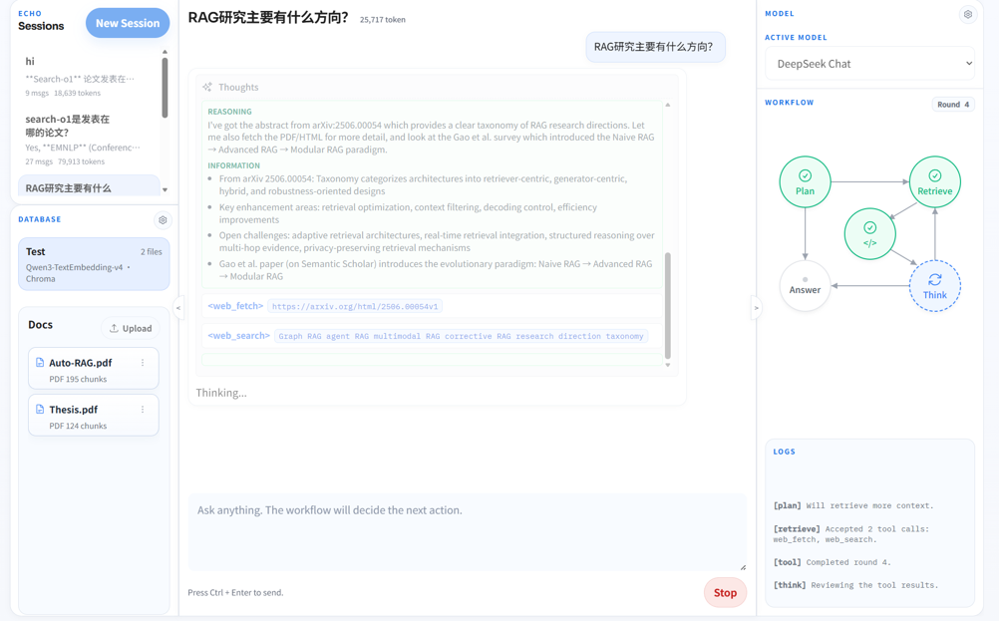
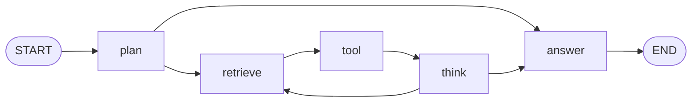

> ***Echo*** is an observable LLM workspace for chat, tool execution, RAG, skills, and a visible decision workflow.




## Highlights

- Built-in ***MCP-style tools*** for skill loading, date lookup, database search, web search, web fetch, and bounded workspace file operations.
- Observable LangGraph workflow: `plan -> retrieve -> tool -> think -> answer`.
- Provider-native tool calls only. Text protocols such as `<retrieve>` and `<echo_retrieve>` are rejected.
- Parallel tool-call batches are supported: one `plan` or `think` decision can request multiple independent tools, and Echo returns one matched tool result per provider tool-call id.
- Live SSE streaming for workflow snapshots, internal records, final answer chunks, completion payloads, and errors.
- Persistent chat sessions stored as local JSON, with internal workflow records grouped under the final answer in the UI.
- OpenAI-compatible chat providers through Chat Completions or Responses wire formats.
- OpenAI-compatible embedding providers, including local services exposed through `/v1/embeddings`.
- React 19 + TypeScript + Vite web UI with chat, workflow, database, model, runtime, and skill settings.
- FastAPI backend with REST endpoints, streaming chat APIs, uploaded-file indexing jobs, and static serving for built frontend assets.
- RAG pipeline with per-database embedding model pairing:
  - Selectable Chroma or FAISS vector storage under `db/`.
  - Document upload, async indexing, listing, rename, and delete for `.md`, `.txt`, and `.pdf`.
  - Optional Marker-powered PDF conversion with PyPDF2 fallback.
- Multiple web search backends and optional web-fetch screenshot mode for vision-capable models.

## Workflow

Echo uses one fixed workflow shape. `plan` and `think` are the only model decision nodes. `retrieve` and `answer` are internal control nodes. `tool` executes pending MCP tool calls.



Decision nodes may either prepare an `<echo_answer>...</echo_answer>` block or emit one or more provider-native tool calls. When multiple tool calls are emitted together, Echo treats them as one retrieval round, executes them concurrently, appends all tool results to the flat in-turn transcript, and then routes to `think`.

Tool results are available to the model during the same workflow turn. Raw tool result bodies are not carried into later long-term chat context; later turns keep a compact assistant workflow context plus the visible final answer.

## Architecture

```text
Echo/
├── apps/
│   ├── api/                  # FastAPI backend
│   ├── desktop/              # Reserved desktop shell
│   └── web/                  # React + TypeScript frontend
├── echo/
│   ├── chat/                 # Chat models, sessions, context, service layer
│   ├── skills/               # Skill catalog, bundled skills, skill settings
│   └── workflow/             # LangGraph graph, nodes, prompts, tracking
├── mcp_server/
│   ├── rag/                  # Loading, chunking, embeddings, vector DB registry
│   └── tools/                # Tool implementations used by the workflow
├── memory/                   # Local session memory and workflow drafts
├── data/                     # Uploads and bounded workspace files
├── db/                       # Chroma/FAISS vector database storage
├── tests/
├── models.json               # Local model provider settings, ignored by Git
├── databases.json            # Local database registry, ignored by Git
├── settings.json             # Runtime app settings
└── run.py                    # Backend development entry point
```

The main runtime path is:

```text
React UI -> FastAPI -> ChatService -> WorkflowService -> LangGraph -> Model + Tools
```

When `apps/web/dist` exists, the FastAPI app mounts it at `/ui`.

## RAG Model

Echo pairs every vector database with exactly one embedding model.

This constraint is deliberate:

- A database is created with one embedding model identity.
- A database is created with one vector backend: `chroma` or `faiss`.
- New databases use `settings.json` `default_database_backend` when no backend is specified.
- Documents inserted into that database use the paired embedding model.
- Queries against that database use the paired embedding model.
- Embedding providers are always treated as external OpenAI-compatible APIs.

***Echo*** does not host an embedding inference service in the main app process. A local embedding server works as long as it exposes an OpenAI-compatible `/v1/embeddings` API and is configured in `models.json`.

Supported upload formats:

- Markdown: `.md`
- Plain text: `.txt`
- PDF: `.pdf`

PDF loading uses `marker_single` when Marker is installed and enabled. If Marker is unavailable or fails, Echo falls back to PyPDF2 for text extraction.

## Tech Stack

| Area | Stack |
| --- | --- |
| Backend | Python 3.12+, FastAPI, Pydantic, Uvicorn |
| Workflow | LangGraph |
| Models | OpenAI-compatible Chat Completions or Responses APIs |
| Retrieval | ChromaDB or FAISS, custom loaders/chunkers/assembler |
| Frontend | React 19, TypeScript, Vite, native CSS |
| Streaming | Server-Sent Events |

## Quick Start

### 1. Install Python dependencies

```bash
git clone <your-fork-or-repo-url>
cd Echo

python -m venv .venv
.\.venv\Scripts\activate
python -m pip install --upgrade pip
python -m pip install -e .
```

On Linux or macOS:

```bash
python -m venv .venv
source .venv/bin/activate
python -m pip install --upgrade pip
python -m pip install -e .
```

If you use Conda, the project also works with an existing Python 3.12 environment:

```bash
conda activate llm
python -m pip install -e .
```

### 2. Configure model providers

Create or edit `models.json` in the repository root. The file is intentionally ignored by Git because it may contain API keys.

```json
{
  "active_chat_model": "Default Chat",
  "active_embedding_model": "Local Embeddings",
  "chat_models": [
    {
      "name": "Default Chat",
      "model": "your-chat-model",
      "api_key": "your-api-key",
      "base_url": "https://your-provider.example/v1",
      "wire_api": "chat_completions",
      "temperature": 1.0,
      "top_p": null,
      "custom_request_params": null
    }
  ],
  "embedding_models": [
    {
      "name": "Local Embeddings",
      "model": "your-embedding-model",
      "api_key": "local-or-provider-key",
      "base_url": "http://127.0.0.1:8092/v1",
      "batch_size": null
    }
  ]
}
```

Supported chat wire APIs:

- `chat_completions`
- `responses`

For local E5 embeddings, install the optional local embedding extra and manually launch the standalone OpenAI-compatible service:

```bash
python -m pip install -e ".[local-embeddings]"
python -m mcp_server.local_e5_embedder --host 127.0.0.1 --port 8092 --model intfloat/e5-base-v2
```

Then configure an embedding model with `base_url: "http://127.0.0.1:8092/v1"`, `api_key: "local-e5-service"`, and `model: "intfloat/e5-base-v2"`.

You can also edit model, runtime, database, and skill settings from the web UI after the app starts.

### 3. Start the backend

```bash
python -m uvicorn apps.api.app.main:app --reload
```

Or use the small development entry point:

```bash
python run.py
```

The backend runs on `http://127.0.0.1:8000` by default.

### 4. Build or run the web UI

For the simplest full-stack local run, build the frontend and let FastAPI serve it:

```bash
cd apps/web
npm install
npm run build
cd ../..
```

Then open `http://127.0.0.1:8000/ui`.

For frontend development:

```bash
cd apps/web
npm install
npm run dev
```

The frontend uses same-origin `/api` requests. If you use Vite directly, configure a local proxy or reverse proxy to send `/api` traffic to the FastAPI backend.

## Optional PDF Setup

Install Marker for richer PDF conversion:

```bash
python -m pip install marker-pdf
```

If you want Marker to use NVIDIA GPU acceleration, install a CUDA-enabled PyTorch build in your Python environment:

```bash
python -m pip install --upgrade --force-reinstall torch torchvision torchaudio --index-url https://download.pytorch.org/whl/cu128
python -c "import torch; print(torch.__version__); print(torch.cuda.is_available())"
```

Marker usage is controlled by `settings.json`:

```json
{
  "use_marker_pdf_loader": true
}
```

## Configuration

### `settings.json`

Runtime settings:

```json
{
  "chunk_size": 800,
  "chunk_overlap": 50,
  "max_retrieve_rounds": 10,
  "max_database_search_top_k": 5,
  "max_web_search_results": 7,
  "max_parallel_tool_calls": 3,
  "use_marker_pdf_loader": true,
  "default_database_backend": "chroma",
  "web_search_backend": "auto",
  "web_fetch_screenshot_mode": false,
  "enabled_skills": ["search", "workspace-files"],
  "default_skills": ["search"]
}
```

Search backends:

- `auto`
- `duckduckgo`
- `baidu`

Database backends:

- `chroma`
- `faiss`

`max_retrieve_rounds` counts workflow retrieval rounds. A round may contain one tool call or a parallel batch of independent tool calls.

`web_fetch_screenshot_mode` requires Playwright browser installation:

```bash
python -m playwright install chromium
```

### `databases.json`

`databases.json` is created and maintained by the backend. It stores the active database selection plus each database's paired embedding model identity and vector backend.

You normally manage this from the UI or API instead of editing it manually.

## API Overview

Core endpoints:

| Endpoint | Purpose |
| --- | --- |
| `GET /api/health` | Health check and active model preview. |
| `GET /api/meta` | Workflow statuses, steps, and default system prompt. |
| `GET /api/model-settings` | Read model settings. |
| `PUT /api/model-settings` | Save model settings. |
| `POST /api/model-settings/test` | Test chat or embedding provider settings. |
| `GET /api/app-settings` | Read runtime settings. |
| `PUT /api/app-settings` | Save runtime settings. |
| `GET /api/skills` | Read skill settings and bundled/editable skill content. |
| `PUT /api/skills` | Save skill settings and editable skill files. |
| `GET /api/databases` | List databases and active database. |
| `POST /api/databases` | Create and select a database. |
| `PATCH /api/databases/{database_id}` | Rename a database. |
| `POST /api/databases/{database_id}/select` | Select the active database. |
| `DELETE /api/databases/{database_id}` | Delete a database and its vector collection. |
| `POST /api/databases/{database_id}/documents` | Upload and index documents synchronously. |
| `POST /api/databases/{database_id}/documents/jobs` | Upload and index documents asynchronously. |
| `GET /api/databases/{database_id}/documents/jobs/current` | Read the active upload job for a database. |
| `GET /api/databases/{database_id}/documents/jobs/{job_id}` | Read one upload job. |
| `GET /api/databases/{database_id}/documents` | List indexed document summaries. |
| `PATCH /api/databases/{database_id}/documents/{document_id}` | Rename an indexed document. |
| `DELETE /api/databases/{database_id}/documents/{document_id}` | Delete an indexed document. |
| `GET /api/sessions` | List chat sessions. |
| `POST /api/sessions` | Create a session. |
| `GET /api/sessions/{session_id}` | Read one session with messages. |
| `PATCH /api/sessions/{session_id}` | Rename a session. |
| `PATCH /api/sessions/{session_id}/system-prompt` | Replace the session system prompt. |
| `DELETE /api/sessions/{session_id}` | Delete a session. |
| `POST /api/sessions/{session_id}/messages/stream` | Stream a new chat turn with SSE. |
| `PATCH /api/sessions/{session_id}/messages/{message_id}` | Edit a mutable message. |
| `DELETE /api/sessions/{session_id}/messages/{message_id}` | Delete a mutable message. |
| `POST /api/sessions/{session_id}/messages/{message_id}/rollback` | Roll back to a mutable message. |
| `POST /api/sessions/{session_id}/messages/{message_id}/regenerate/stream` | Regenerate a previous turn with SSE. |
| `GET /api/artifacts/{path}` | Serve persisted chat artifacts such as web-fetch screenshots. |

Streaming chat emits these SSE events:

- `workflow`: live workflow snapshot.
- `record`: one persisted or live internal workflow record.
- `chunk`: incremental final-answer text.
- `done`: final persisted session state and workflow summary.
- `error`: terminal stream error payload.

See [apps/api/README.md](apps/api/README.md), [apps/web/README.md](apps/web/README.md), and [echo/workflow/README.md](echo/workflow/README.md) for implementation details.

## Tooling

Registered workflow tools:

- `load_skill`
- `date`
- `database_search`
- `web_search`
- `web_fetch`
- `workspace_list_files`
- `workspace_read_file`
- `workspace_write_file`
- `workspace_edit_file`

Workspace file tools are bounded to `data/workspace` and reject absolute paths or paths that escape that directory.

## Development

Backend:

```bash
python -m uvicorn apps.api.app.main:app --reload
```

Frontend:

```bash
cd apps/web
npm install
npm run dev
```

Build frontend:

```bash
cd apps/web
npm run build
```

Run Python unit tests:

```bash
python -m unittest discover tests/unit
```

The unit test suite covers chat memory, workflow routing, SSE adaptation, API behavior, model adapters, skills, tools, database registry, indexing, web search, and workspace files.

## Documentation

- [API backend](apps/api/README.md)
- [Web frontend](apps/web/README.md)
- [Workflow design](echo/workflow/README.md)
- [Eval workflow](tests/eval/README.md)

## Security Notes

- Do not commit real API keys, local provider credentials, uploaded documents, chat memory, or vector database contents.
- `models.json`, `databases.json`, `db/`, `data/`, and `memory/chat_sessions/` are local runtime state.
- If a credential was committed accidentally, rotate it immediately.
- Web search and web fetch tools access external network resources. Review `settings.json` and enabled skills before exposing Echo beyond a trusted local environment.

## Contributing

Contributions are welcome once the repository has a clear public contribution policy.

Good first areas:

- Improve setup documentation for different model providers.
- Add integration tests for streaming chat and document indexing.
- Expand provider-specific setup examples.
- Add more robust dev proxy instructions for Vite.
- Package a desktop shell under `apps/desktop`.

Before opening a pull request:

1. Keep changes focused.
2. Update documentation when behavior changes.
3. Run `python -m unittest discover tests/unit`.
4. Run `npm run build` in `apps/web` when frontend code changes.
5. Never include local secrets or runtime state.

## Licenses

Echo is released under the [MIT License](LICENSE).
